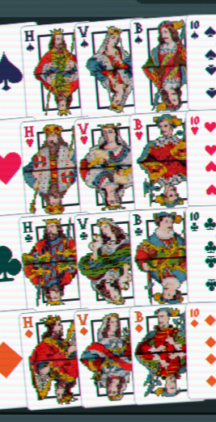
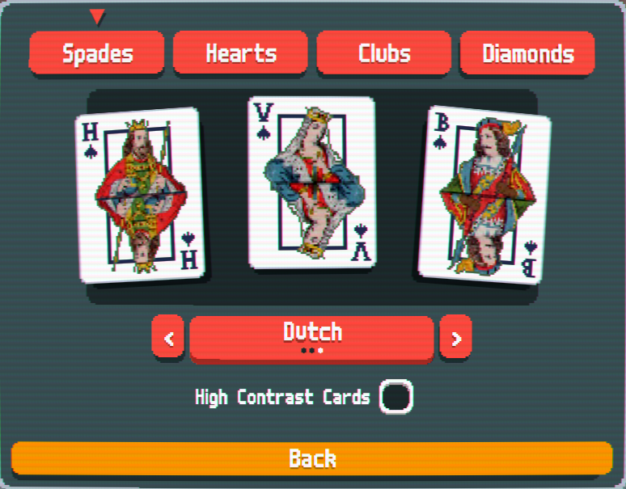
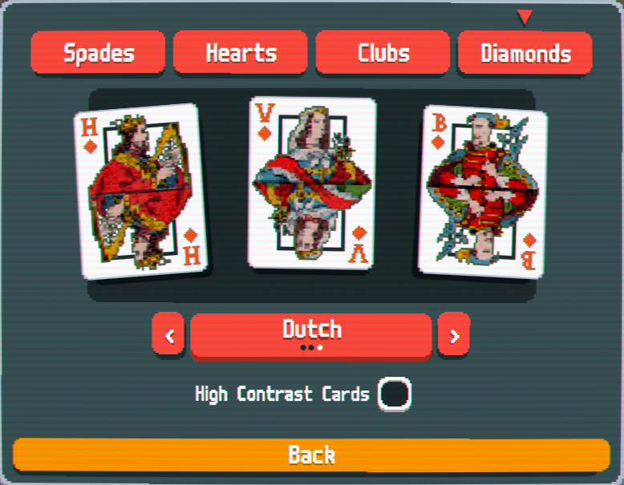
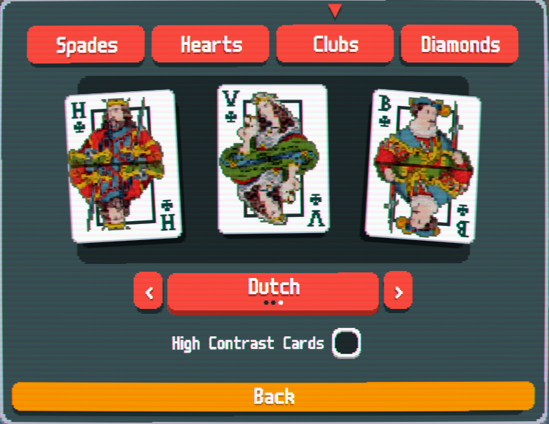
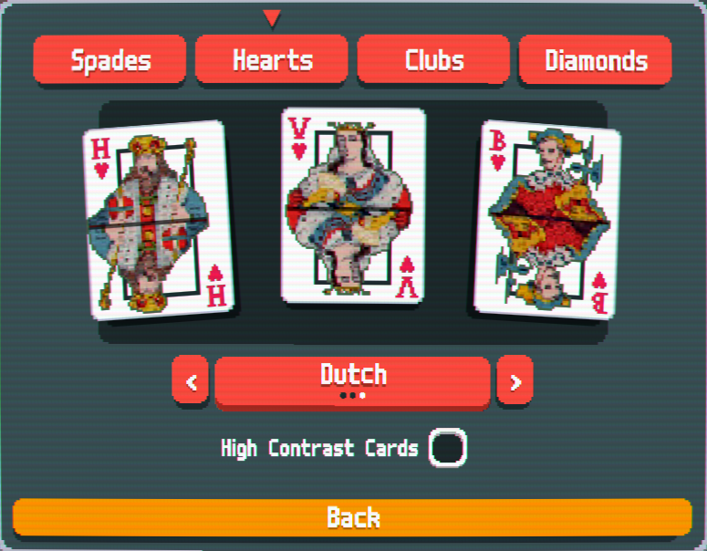

# dutchies
----------
a mod which lets you customize the face cards into dutch face cards! 
 
(the art is very detailed so also kind of blurry, maybe i'll get a simplefied version in sometime)
there also isn't a high contrast YET
-----
Q: how did you make the art?  
 
A: i took a pickture of google called: dutch face cards, then i put it into "pixelart" (actuall name of site).
then i fixed them up! (removing the background, fixing the cut off, all those things)
and last i fixed the code for each suit (using the example from SDM_0)
----
# how does it look in game?
----
  
  
  
  
  

Creddits: 
Art - MiniRebel  
Code - MiniRebel  
Ideas - Minirebel 
Special thanks to SDM_0 for the example i could build on. 
